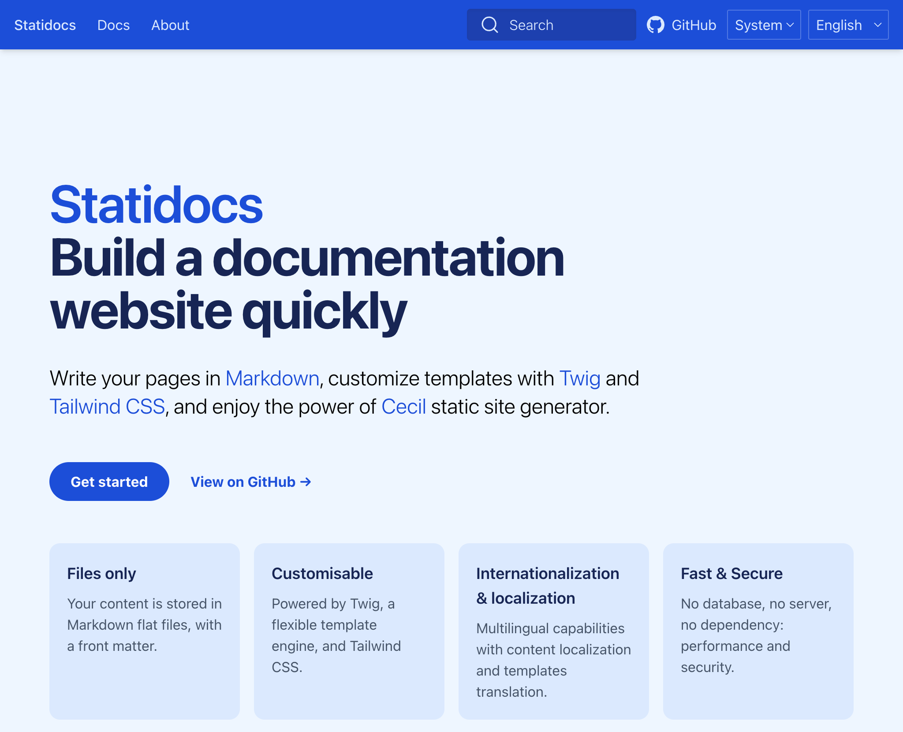

# Statidocs

Statidocs is a documentation starter site, built on top of [Cecil](https://cecil.app) and the [Docs theme](https://github.com/Cecilapp/theme-docs).

[](https://statidocs.cecil.app)

> [!IMPORTANT]  
> Statidocs is still in development. If something that’s not working, please [open an issue on GitHub](https://github.com/Cecilapp/statidocs/issues/new/choose).

## Install

The easiest way to create a new Statidocs project is using [Composer](https://getcomposer.org):

```bash
composer create-project cecil/statidocs my-project
```

[](https://packagist.org/packages/cecil/statidocs)

## Demo

- Hosted by GitHub Pages: <https://cecilapp.github.io/statidocs/>
- Hosted by Vercel: <https://statidocs.vercel.app>

## Usage

Build & preview:

```bash
php cecil.phar serve
```

Read the [documentation](https://statidocs.cecil.app).

### Update themes

Statidocs is depending of Cecil's themes [Docs](https://github.com/Cecilapp/theme-docs) and [PWA](https://github.com/Cecilapp/theme-pwa).

Use Composer to update them:

```bash
composer update
```

### Configuration

Open and edit the [`cecil.yml`](cecil.yml) file.

### Customize colors

Checks the [`tailwind.config.js`](tailwind.config.js) file, then rebuild the CSS file:

```bash
npm install
npx tailwindcss -i ./themes/docs/tailwind.css -o ./assets/styles.css
```

## Publish

```bash
php cecil.phar build
```

Then copy content of `_site` to your web server.

## To lunch the server and drop the cashe use this bash 

```bash
./server.sh 

```
## To add new pages 

you need to add your code in the database you can look at the structure in table.sql and exemple of insert in insert_data.sql 

after that you can use this bash which takes two parameters the path file.md and the language like (fr , en , es)

```bash
$ ./mon_script.sh pages/docs/sms/smsp1.md es

```
